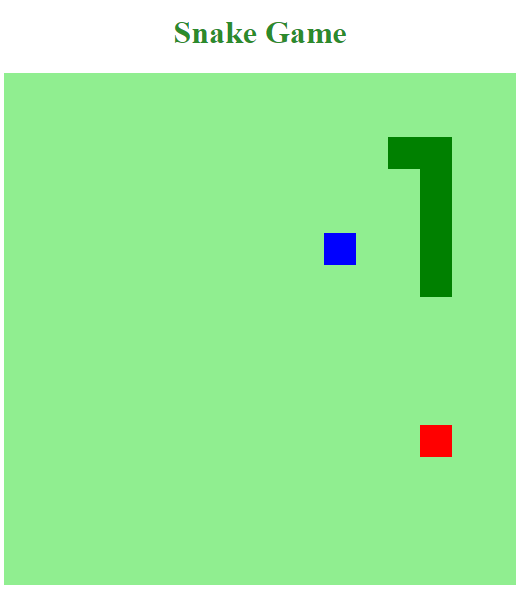

# Snake Game
Pequenas modificações do Lab **"Recriando o Jogo da Cobrinha com Javascript"** da [Digital Innovation One](https://digitalinnovation.one).

## Modificações
Há um novo tipo de "comida" (na cor azul) que reduz o tamanho da cobrinha por dois blocos. Entretanto, o novo tipo aparece com uma frequência menor e fica visível por um curto período de tempo.

## Instruções
Para jogar, abra o `index.html` no seu navegador.

Use as setas direcionais do teclado para guiar a cobrinha.

## Tecnologias utilizadas
- CSS
- HTML
- JavaScript

## Screenshots

